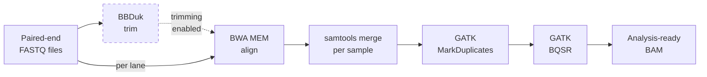

# sm-alignment

Snakemake pipeline for DNA sequence alignment and BAM processing on SLURM HPC clusters.

Designed for SLURM HPC clusters with automatic cluster detection.



---

## Setup

### Prerequisites

You need **Snakemake 8+** and **conda/mamba**. Install via [Miniforge](https://github.com/conda-forge/miniforge) (do not use Anaconda):

```bash
mamba create -n snakemake -y -c conda-forge -c bioconda python=3.11 snakemake=8
conda activate snakemake
```

Pipeline tools (BWA, GATK, samtools, BBDuk) are installed automatically as per-rule conda environments on first run — no manual tool installation needed. See [Software Deployment](#software-deployment) for alternatives.

### 1. Clone the repository

```bash
git clone https://github.com/scholl-lab/sm-alignment.git
cd sm-alignment
```

Recommended project layout:

```
<your-project>/
├── sm-alignment/                    # this pipeline (git clone)
│   ├── workflow/
│   ├── config/
│   │   ├── config.yaml              # ← edit for your project
│   │   └── samples.tsv              # ← generate from SampleSheet
│   ├── profiles/
│   └── scripts/
├── resources/                       # reference data (or symlinks to shared)
│   ├── ref/GRCh38/
│   └── gatk_bundle/hg38/
└── data/                            # raw FASTQ deliveries (or symlinks)
```

### 2. Set up reference data

The pipeline requires a reference genome and known-sites VCFs for base quality score recalibration (BQSR):

| Data | Source | Maps to `config.yaml` |
|------|--------|-----------------------|
| **GRCh38 no-alt analysis set** (FASTA + BWA index + .fai + .dict) | [NCBI FTP](https://ftp.ncbi.nlm.nih.gov/genomes/all/GCA/000/001/405/GCA_000001405.15_GRCh38/seqs_for_alignment_pipelines.ucsc_ids/) | `ref.genome` |
| **dbSNP 138** | [Google Cloud — Broad references](https://console.cloud.google.com/storage/browser/gcp-public-data--broad-references/hg38/v0) | `ref.known_sites[]` |
| **Known indels** | same bucket | `ref.known_sites[]` |
| **Mills & 1000G gold-standard indels** | same bucket | `ref.known_sites[]` |

Download the files and place them under `resources/` as shown in the project layout above. Then point `config/config.yaml` at the paths, or use `generate_config.py --config-template` to auto-detect them (see [Generate Config Files](#generate-config-files)).

---

## Generate Config Files

### Interactive wizard (recommended for first-time setup)

Run without arguments to get a step-by-step guided setup:

```bash
python scripts/generate_config.py
```

The wizard prompts for FASTQ directory, SampleSheet, project name, reference data location, and output paths. It auto-detects defaults where possible.

### From a sequencing facility delivery (flags mode)

When you receive FASTQ files with a `SampleSheet.csv` from the core facility:

```bash
# Generate samples.tsv from the delivery folder
python scripts/generate_config.py \
    --fastq-dir /path/to/delivery_folder/

# Output:
#   Found SampleSheet.csv with 2 samples
#   Matched 4 FASTQ files (2 pairs)
#   Written: config/samples.tsv (2 samples)
```

The script auto-detects `SampleSheet.csv` in the FASTQ directory, parses Illumina filenames, and generates `config/samples.tsv`. It handles both standard Illumina `[Data]` format and minimal CSV formats.

**Options:**

```bash
# Preview without writing (dry-run)
python scripts/generate_config.py --fastq-dir /path/to/fastqs --dry-run

# Generate samples.tsv AND config.yaml (scans for reference genome + known-sites)
python scripts/generate_config.py --fastq-dir /path/to/fastqs --config-template

# Point to a specific reference data directory
python scripts/generate_config.py --fastq-dir /path/to/fastqs --config-template \
    --ref-dir /path/to/resources/ref/GRCh38

# Override project name
python scripts/generate_config.py --fastq-dir /path/to/fastqs --project MyProject

# Overwrite existing files
python scripts/generate_config.py --fastq-dir /path/to/fastqs --force
```

When `--config-template` is used, the script scans for reference data:

1. **Explicit** `--ref-dir` (if provided)
2. **Relative** paths near the FASTQ directory (`resources/ref/GRCh38/`, `resources/gatk_bundle/hg38/`, etc.)

It checks for companion files (BWA index, FAI, dict, tabix index) and reports what it finds. Discovered paths are written directly into `config/config.yaml`. Any paths not found are marked with `EDIT_ME:` placeholders.

### Review config/config.yaml

After generating, review the config and adjust paths if needed:

```yaml
ref:
  genome: "/path/to/resources/ref/GRCh38/GCA_000001405.15_GRCh38_no_alt_analysis_set.fna"
  known_sites:
    - "/path/to/resources/gatk_bundle/hg38/Homo_sapiens_assembly38.dbsnp138.vcf"
    - "/path/to/resources/gatk_bundle/hg38/Homo_sapiens_assembly38.known_indels.vcf.gz"
    - "/path/to/resources/gatk_bundle/hg38/Mills_and_1000G_gold_standard.indels.hg38.vcf.gz"

paths:
  fastq_folder: "/path/to/your/fastq/directory"   # auto-filled from --fastq-dir
  output_folder: "results/MyProject"               # auto-filled from project name

trimming:
  enabled: false    # set to true to auto-trim before alignment
```

---

## Run the Pipeline

### Dry-run first

Always verify the execution plan before submitting:

```bash
# On a compute or login node
conda activate snakemake

snakemake -s workflow/Snakefile --configfile config/config.yaml -n
```

### Submit to SLURM

```bash
# Create log directory
mkdir -p slurm_logs

# Submit — cluster is auto-detected
sbatch scripts/run_snakemake.sh workflow/Snakefile
```

The launcher auto-detects your cluster environment and selects the appropriate SLURM submission method. If no known cluster is detected, it falls back to local execution.

### Usage examples

```bash
# Custom config file
sbatch scripts/run_snakemake.sh workflow/Snakefile config/my_config.yaml

# Custom job name (visible in squeue)
sbatch --job-name=sm_exomes scripts/run_snakemake.sh workflow/Snakefile

# Pass extra Snakemake flags
sbatch scripts/run_snakemake.sh workflow/Snakefile config/config.yaml --forceall

# Override resources for a single run
sbatch scripts/run_snakemake.sh workflow/Snakefile config/config.yaml \
    --set-threads bwa_map=8 --set-resources bwa_map:mem_mb=9600
```

### Monitor progress

```bash
# Check running jobs
squeue -u $USER

# Follow coordinator log
tail -f slurm_logs/sm_pipeline-*.log

# Follow individual rule logs
tail -f slurm_logs/slurm-*.log
```

---

## Configuration Reference

### `config/config.yaml`

| Section | Key settings |
|---|---|
| `ref` | `genome`, `build`, `known_sites` (list of VCFs for BQSR) |
| `paths` | `fastq_folder`, `output_folder`, `samples` (path to TSV) |
| `trimming` | Set `enabled: true` to run BBDuk adapter trimming before alignment |
| `params` | Extra CLI flags passed through to bwa, samtools, GATK tools |
| `subset` | Optional BAM subsetting by BED regions |

### `config/samples.tsv`

One row per FASTQ pair (per lane). Samples sequenced across multiple lanes have multiple rows — the pipeline aligns each lane independently and merges by `project_sample`.

| Column | Example | Required | Description |
|---|---|---|---|
| `fastq_files_basename` | `Sample1_S1_L001` | yes | FASTQ filename prefix (before `_R1_001.fastq.gz`). Must be unique — used as index. |
| `lane` | `L001` | yes | Sequencing lane. Used in the read group ID (`@RG ID:{lane}-{sample}`) and PU tag. |
| `project_sample` | `Sample1` | yes | Logical sample name. All rows sharing this value are merged into one BAM after alignment. |
| `mdc_project` | `ProjectX` | yes | Project identifier. Used in the read group PU tag (`PU:{lane}-{project}`). |
| `subfolder` | `run1` | no | Subdirectory within the FASTQ folder, for deliveries split across sub-directories. |

**Multi-lane example** — one sample sequenced on two lanes produces two rows:

```tsv
fastq_files_basename	lane	project_sample	mdc_project
Sample1_S1_L001	L001	Sample1	ProjectX
Sample1_S1_L002	L002	Sample1	ProjectX
```

This generates two lane-level BAMs that are merged into a single `Sample1.bam` before deduplication.

**Generating `samples.tsv`:**

- **Automatic** (recommended): `python scripts/generate_config.py --fastq-dir /path/to/fastqs` parses the Illumina `SampleSheet.csv` and FASTQ filenames. Run with `--help` for all options, or without arguments for the interactive wizard.
- **Manual**: create a tab-separated file with the columns above. Ensure `fastq_files_basename` matches the actual FASTQ filenames in your `paths.fastq_folder` directory.

### `profiles/default/config.yaml`

Per-rule resource allocation (threads, memory, walltime). Adjust for your cluster without touching workflow code.

### `profiles/charite/config.yaml`

Cluster-specific SLURM executor plugin settings. Used automatically when the launcher detects a matching cluster.

---

## Tools & Conda Environments

| Conda env | Tools | Used by |
|---|---|---|
| `workflow/envs/bwa_samtools.yaml` | bwa 0.7.18, samtools 1.21, samblaster 0.1.26 | alignment, merge, utilities |
| `workflow/envs/gatk.yaml` | gatk4 4.6.1.0, samtools 1.21 | dedup, BQSR |
| `workflow/envs/bbtools.yaml` | bbmap 39.06 | trimming |

Conda environments are created automatically by Snakemake on first run (`software-deployment-method: conda` in the workflow profile).

### Software Deployment

The pipeline supports two software deployment strategies:

**1. Per-rule conda environments (default)**

Snakemake creates isolated conda environments from `workflow/envs/*.yaml` on the first run. This is fully reproducible but slow initially. Use `--conda-prefix` to share envs across projects:

```bash
snakemake --conda-prefix /shared/conda-envs ...
```

**2. Pre-installed tools (skip per-rule conda)**

Install all tools directly into your `snakemake` environment and disable per-rule conda. This avoids the first-run env creation overhead and works around mamba 2.x incompatibilities:

```bash
# Install tools into the snakemake environment
mamba install -n snakemake -c bioconda -c conda-forge \
    bwa=0.7.18 samtools=1.21 samblaster=0.1.26 gatk4=4.6.1.0 bbmap=39.06
```

Then comment out `software-deployment-method` in `profiles/default/config.yaml` or pass `--sdm none` on the CLI:

```bash
sbatch scripts/run_snakemake.sh workflow/Snakefile config/config.yaml --sdm none
```

---

## Deprecated Files

Old standalone workflows and SLURM launchers are in `deprecated/` for reference during migration. See `deprecated/README.md` for details. Scheduled for removal August 2025.

## License

MIT
